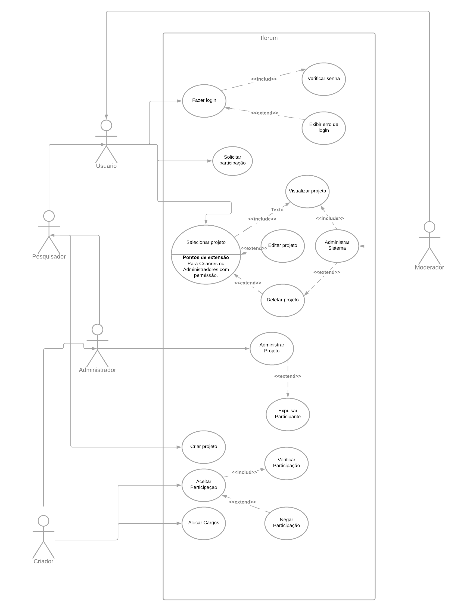

# iTeamManager
## Descrição

Esse projeto apresenta a proposta de uma ferramenta de integração entre as matriz curriculares dos discentes e docentes do IFPI. A ferramenta disporá de duas frontes, um sistema de busca para encontrar pessoas com conhecimentos específicos para o seu projeto, e grupos onde os projetos gerados no sistema possam ser discutidos mais detalhadamente.

## Justificativa

Este projeto busca resolver uma problemática que muitas vezes não é vista pelo grande público, a falta de acesso à outras áreas de conhecimento na realização de um projeto institucional. Sem uma visão ampla das possibilidades, o docente limita-se ao escopo que lhe é mostrado e nunca é desafiado com novas e inesperadas experiências. A integração destes viria de maneira natural caso tal facilidade fosse lhes apresentada.

## Público Alvo
* Corpo docente
* Corpo discente

## Objetivo Geral
Construir um sistema que simplifique a integração entre discentes e/ou docentes de diferentes áreas do conhecimento em um projeto de pesquisa.

## Objetivos específicos
* Desenvolver um sistema onde todos no instituto tenham acesso aos projetos cadastrados no sistema
* Aplicar sistema de notificação por interesse onde um usuário recebe propostas de projetos que lhe cabem
* Disseminar e incentivar a idéia de projetos integrados

## Funcionalidades do Sistema
| Nome | Atores | Descrição |
| ------ | ------ | ------ |
|Fazer login|Usuário|Esse caso de uso permite que o usuário entre no sistema|
|Exibir erro de Login|Usuário|Exibe-se uma tela de erro e o usuário volta para a tela de Login|
|Verificar senha|Usuário|Sistema verifica se a senha é compatível com a senha cadastrada pelo usuário|
|Pesquisar Projetos|Usuário|O usuário pode pesquisar projetos para ingressar|
|Solicitar Participação|Usuário|O usuário solicita a participação nos projetos que tem interesse|
|Selecionar Projeto|Usuário|O usuário seleciona um projeto de seu interesse para obter acesso a seus detalhes|
|Administrar Projetos|Moderador|O Moderador realiza ações que lhe foram permitidas pelo criador do projeto|
|Visualizar projeto|Usuário|O usuário obtém acesso aos detalhes de um projeto previamente selecionado|
|Editar projeto|Administrador|O usuário com permissão pode editar um projeto|
|Deletar projeto|Administrador, moderador|O usuário com permissão pode excluir um projeto|
|Administrar Projeto|Administrador|Gerenciar o ambiente do projeto para não se tornar toxico|
|Expulsar Participante|Administrador|O Administrador pode expulsar quem ele acha que está atrapalhando no projeto|
|Criar projeto|Pesquisador|Pesquisador pode criar um projeto, dentro desse projeto ele é o criador|
|Verificar Participação|Criador|Descrição - O criador de projeto verifica o perfil do Usuário antes de aceitar u negar sua participação|
|Aceitar Participação|Criador|O criador de projeto permite que o usuário entre para o seu projeto|
|Negar Participação|Criador|O Criador de projeto nega que o usuário entre para o projeto|
|Alocar cargos|Criador|O Criador de projetos pode alocar cargos para quem está abaixo dele na hierarquia do projeto|

## Equipe

| Nome | Github |
| ------ | ------ |
| Artur Oliveira Carvalho | https://github.com/IsNotRaymond |
| Firmo Lopes de Oliveira Neto | https://github.com/ |
| João Victor Sousa Oliveira | https://github.com/ |
| Luiz Araujo da Conceição Junior | https://github.com/Lacj2000 |
| Phelyppe Matheus Silva Da Costa | https://github.com/PhePheMath |

## Casos de Uso

## Especificações dos casos de uso
| UC-01 | Fazer Login |
| ------ | ------ |
|Ator Principal|Usuário|
|Descrição Geral|Esse caso de uso permite que o usuário entre no sistema|
|Pré Condições|O usuário está devidamente registrado no sistema|
|Pós Condições|Verificar as credenciais|
|Fluxo Principal| 1. Usuário aguarda o sistema verificar as credenciais de login   2. O sistema libera a entrada do usuário ao sistema|
|Fluxo Alternativo|2.1. O usuário erra os dados cadastrados de Login, indo para “Exibir erro de Login”|

| UC-02 | Exibir erro de Login |
| ------ | ------ |
|Ator Principal|Usuário|
|Descrição Geral|Exibe-se uma tela de erro e o usuário volta para a tela de Login|
|Pré Condições|Usuário tentar entrar no sistema|
|Pós Condições|Retornar para a tela de login|
|Fluxo Principal| 1. O Sistema exibe uma tela de erro   2. Após alguns segundos o usuário é redirecionado para a tela de Login|
|Fluxo Alternativo||

| UC-03 | Verificar senha |
| ------ | ------ |
|Ator Principal|Usuário|
|Descrição Geral|Sistema verifica se a senha é compatível com a senha cadastrada pelo usuário|
|Pré Condições|O usuário tenta fazer o Login|
|Pós Condições|Entrada no sistema|
|Fluxo Principal| 1. O sistema verifica as credenciais do usuário   2. O usuário adentra ao sistema|
|Fluxo Alternativo|2.1. Inicia o caso de uso “Exibir erro de Login”|

| UC-04 | Solicitar Participação |
| ------ | ------ |
|Ator Principal|Usuário|
|Descrição Geral|O usuário solicita a participação nos projetos que tem interesse|
|Pré Condições|Usuário necessita selecionar um projeto|
|Pós Condições|Não há|
|Fluxo Principal| 1. O usuário encontra um projeto que atraia o seu interesse   2. O usuário submete a sua inscrição no projeto que viu no feed|
|Fluxo Alternativo|1.1 O usuário pesquisa por um nome chave de algum projeto|

| UC-05 | Selecionar Projeto |
| ------ | ------ |
|Ator Principal|Usuário|
|Descrição Geral|O usuário seleciona um projeto de seu interesse para obter acesso a seus detalhes|
|Pré Condições|Usuário necessita estar devidamente logado no sistema|
|Pós Condições|Não há|
|Fluxo Principal| 1. Usuário clica em algum projeto   2. Usuário recebe como resposta as informações do projeto como escopo, criador, requisitos para participar, etc ...  3. Recebe também a opção de solicitar participação e tirar esse projeto das recomendações|
|Fluxo Alternativo|Não há|
